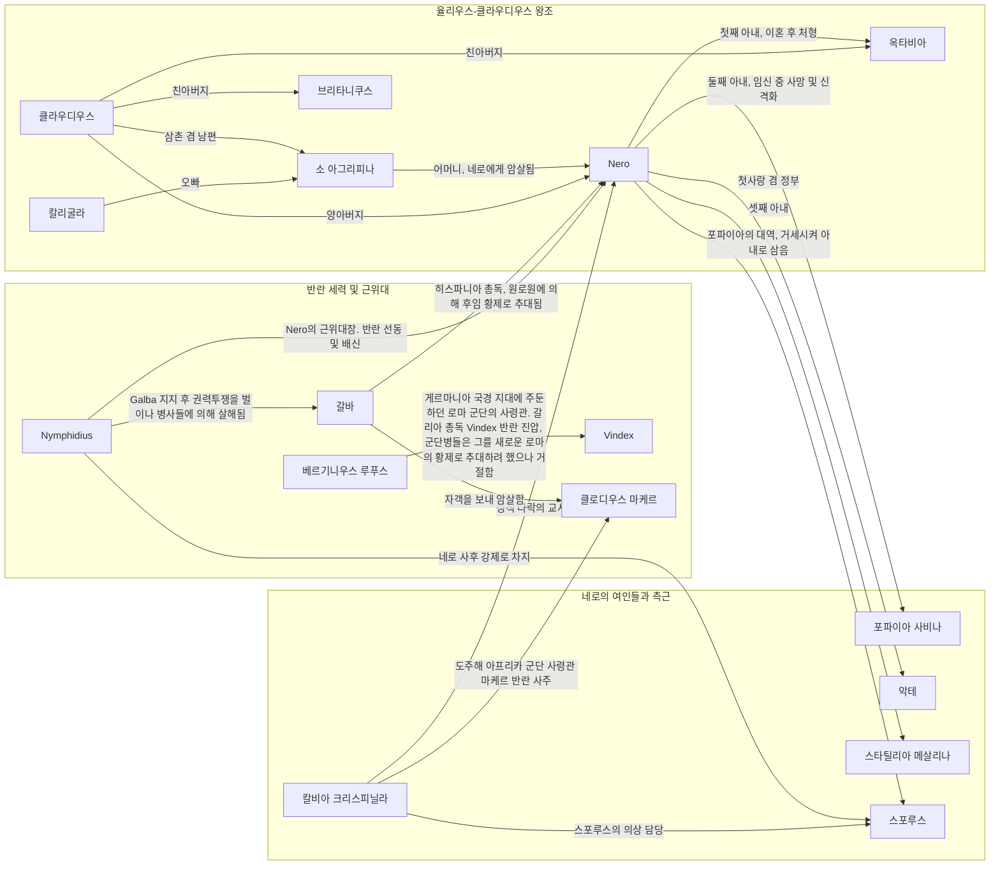

---
{"dg-publish":true,"dg-path":"books/pax.md","permalink":"/books/pax/","title":"Pax","dg-note-properties":{"title":"Pax","subtitle":"War and Peace in Rome's Golden Age","authors":"[Tom Holland]","categories":"[History]","publishDate":"2023-09-26","totalPage":"471","publisher":"Hachette UK","coverUrl":"http://books.google.com/books/content?id=05msEAAAQBAJ&printsec=frontcover&img=1&zoom=1&edge=curl&source=gbs_api","link":"https://play.google.com/store/books/details?id=05msEAAAQBAJ"}}
---

## 나의 메모

### 1장 슬프고 잔인한 신들

