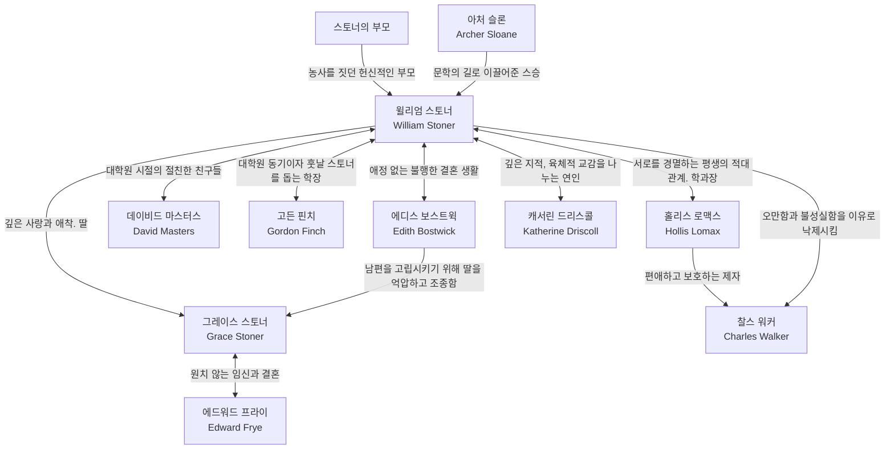

---
{"dg-publish":true,"dg-path":"books/stoner.md","permalink":"/books/stoner/","title":"Stoner","dg-note-properties":{"title":"Stoner","subtitle":"","authors":"[John Williams]","categories":"[Fiction]","publishDate":"2010-05-05","totalPage":"305","publisher":"New York Review of Books","coverUrl":"http://books.google.com/books/content?id=s7sKxilR83YC&printsec=frontcover&img=1&zoom=1&edge=curl&source=gbs_api","link":"https://play.google.com/store/books/details?id=s7sKxilR83YC"}}
---

## 나의 메모

